# PiBuddy

A Raspberry Pi port of [anthropics/claude-desktop-buddy](https://github.com/anthropics/claude-desktop-buddy):
an animated desk companion that reacts to your **Claude Code** sessions — driven
by webhooks from Claude Code's hooks instead of BLE, so any machine on your
network (or several at once) can feed it.

The buddy sleeps when nothing is happening, blinks and idles while sessions are
open, sweats while Claude runs tools, bounces with a "!" when something needs
your permission — and with a touchscreen you can **approve or deny the pending
tool call right on the Pi**.

## The flow, in pictures

All screenshots are rendered by the real UI code (regenerate any time with
`python3 scripts/render-screenshots.py`).

| | |
|---|---|
| **1. Asleep.** No sessions anywhere; after the screen dims an ambient clock takes over. 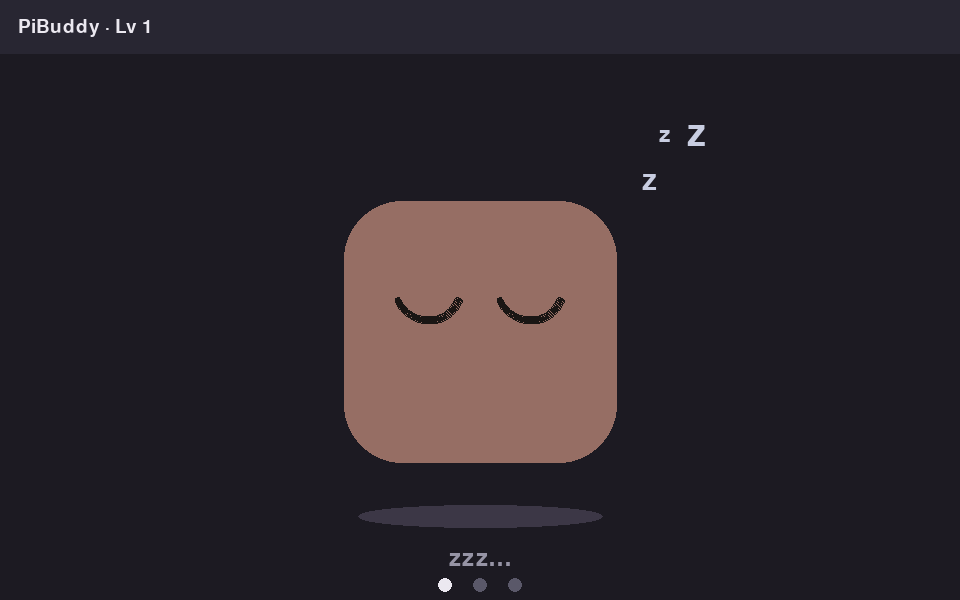 | **2. You start working.** A Claude Code session opens, hooks start flowing, Clawd gets busy (note the sweat drop and the session dot up top). 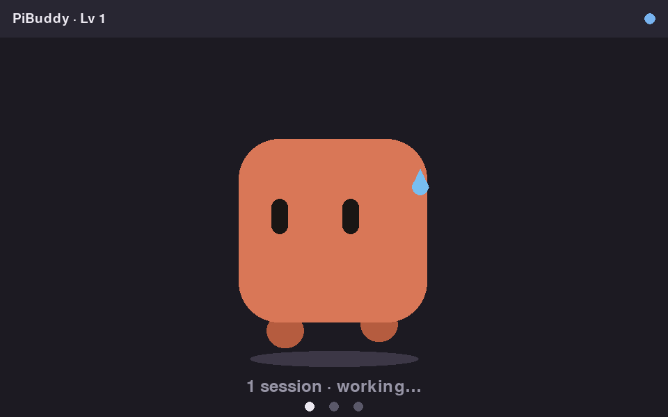 |
| **3. Claude needs you.** A permission prompt is waiting: Clawd bounces with a "!" and the caption changes. 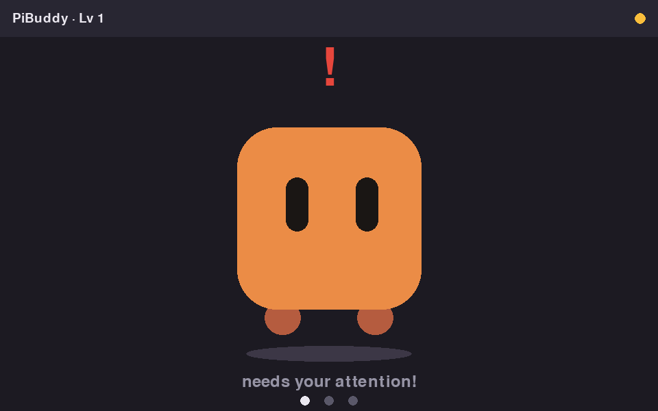 | **4. You ignored him.** After 30 s the screen edge pulses amber; after 60 s it goes red, he jumps harder, and (if sound is on) beeps every 15 s. 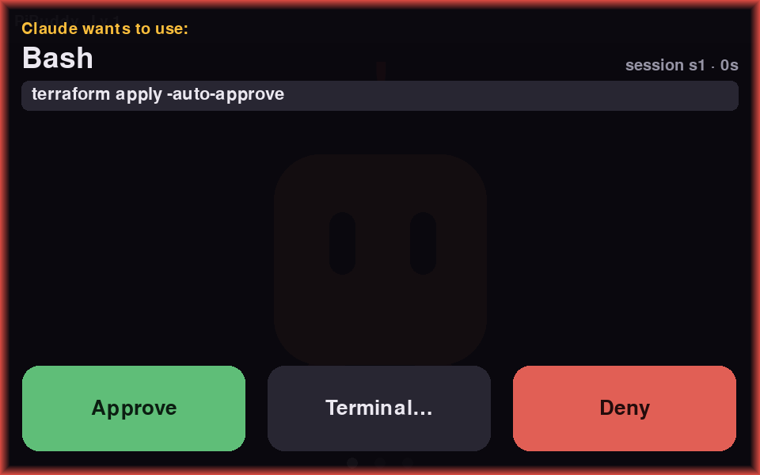 |
| **5. The approval screen.** What the call is for, the exact command, Claude's last message as context, and Approve / Terminal… / Deny. 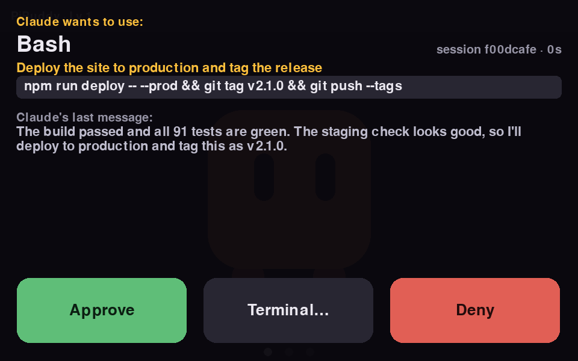 | **6. Task done.** Confetti — and at level 10+ Clawd wears his crown. XP and streaks persist across restarts. 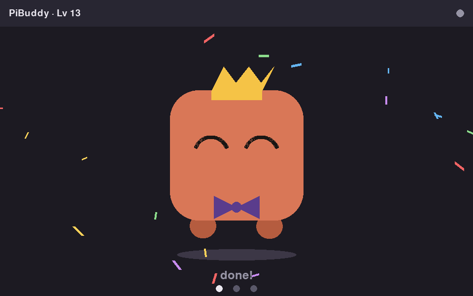 |
| **7. Many terminals?** Buddy grid: one mini-Clawd per session, each with its own mood. 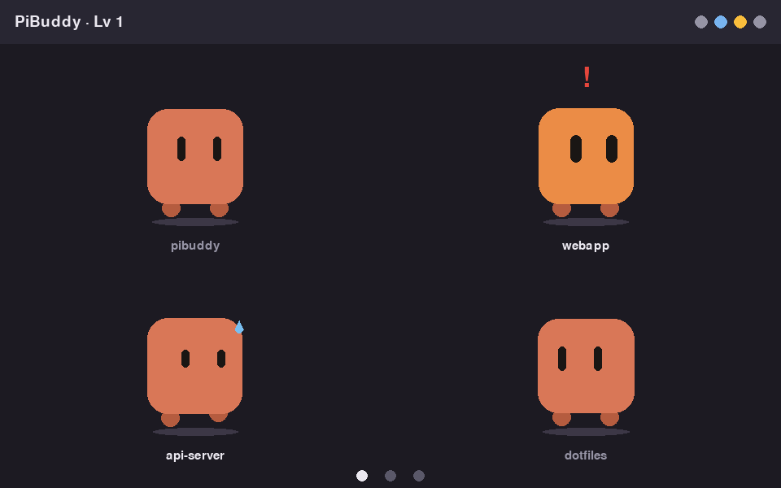 | **8. Swipe →** for the live activity feed: prompts, tool calls, notifications, approval verdicts across all sessions. 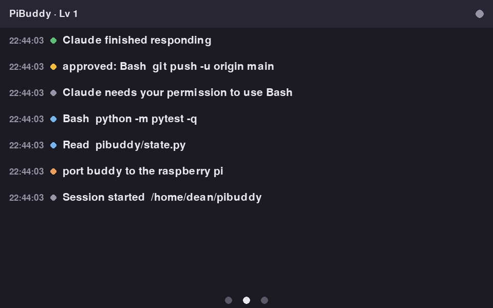 |
| **9. Swipe →** again for stats: streak, activity-by-hour, and a QR code that opens the phone remote. 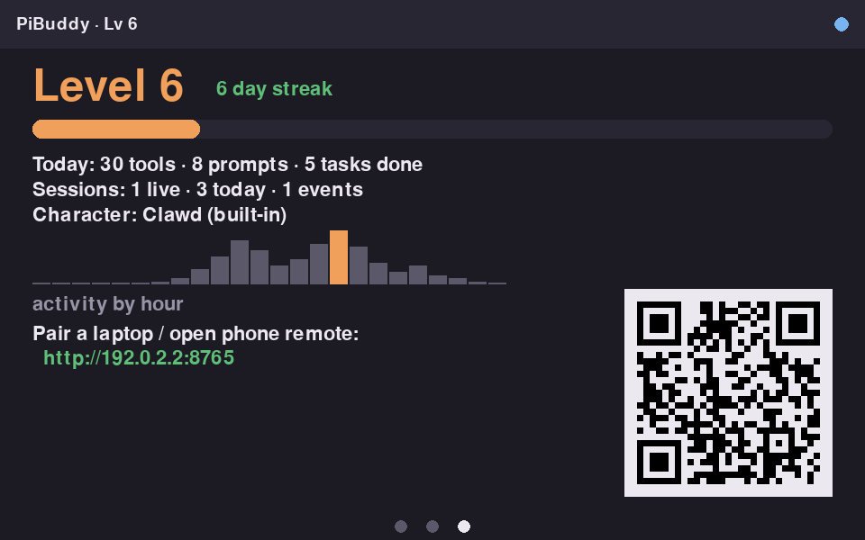 | **10. Long-press** anywhere for settings — including a touch **Exit** button, no keyboard needed. 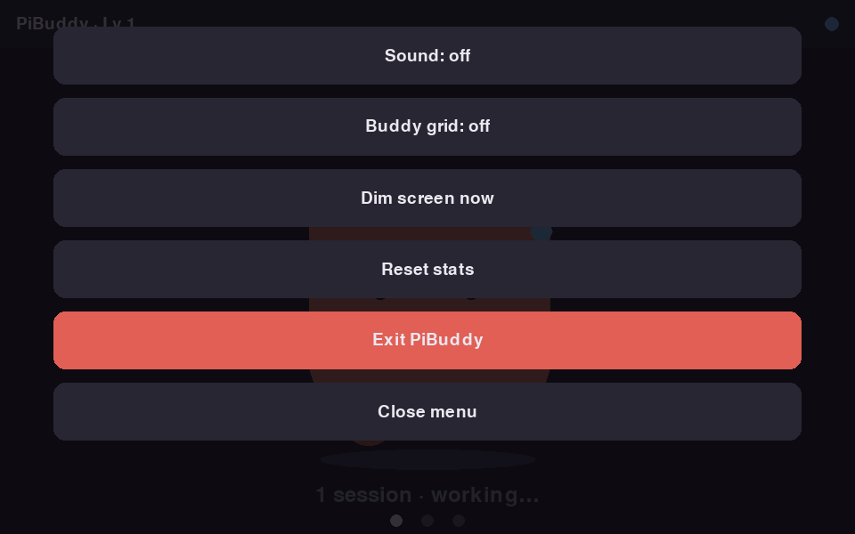 |

And the phone remote (scan the stats-screen QR), for approving from the couch:

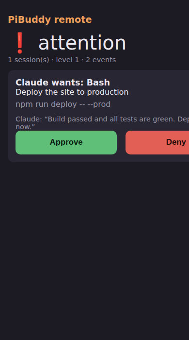

The same UI scales down to small panels — the approval screen on a 3.5" 480×320 hat:

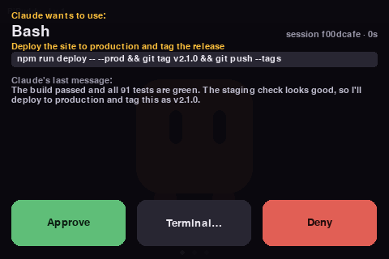

## How it works

Two transports, same hooks, same features — pick per laptop:

```
 your laptop(s)                                    raspberry pi
┌────────────────────────────┐                  ┌──────────────────────────┐
│ Claude Code hooks (curl)   │                  │ pibuddy daemon           │
│                            │   HTTP (LAN)     │  aiohttp server          │
│  A) same network ──────────┼────────────────▶ │  session state machine   │
│                            │                  │  pygame touchscreen UI   │
│  B) no shared network:     │                  │                          │
│     hooks ─▶ localhost ─▶ pibuddy-bridge ──┐  │                          │
│              (same curl)   (persistent BLE)└─▶│  BLE peripheral (--ble)  │
└────────────────────────────┘   Bluetooth LE   └──────────────────────────┘
```

* **A) Network (default):** hooks POST straight to the Pi over the LAN.
* **B) Bluetooth:** when the laptop and Pi don't share a network, run the
  small bridge daemon on the laptop. It keeps one persistent BLE connection
  to the buddy and serves the identical HTTP API on `127.0.0.1:8766`, so the
  hooks are byte-for-byte the same — they just point at localhost. Approvals
  flow back over BLE notifications, so touchscreen (and escalation) work
  identically. See **Bluetooth setup** below.

* Every Claude Code hook event (`SessionStart`, `PreToolUse`, `Stop`, …) is
  forwarded fire-and-forget by `hooks/pibuddy-event.sh` — with a 2 s timeout in
  the background, so a powered-off Pi never slows a session down.
* Optionally, a blocking `PreToolUse` hook (`hooks/pibuddy-approve.sh`) holds
  the tool call while the Pi shows a rich approval overlay: the tool, what
  Claude says the call is for, the exact command in a panel, **Claude's last
  message from the transcript as context** (extracted on your laptop by the
  hook — transcripts never leave it unless you enable this hook), and any
  options the tool call is asking you to choose between. Three buttons:
  **Approve**, **Deny**, and **Terminal…** — the latter (like a timeout or an
  unreachable Pi) leaves the hook silent so Claude Code falls back to its
  normal terminal prompt with the full option list (e.g. "yes, don't ask
  again").
* Multiple sessions are tracked independently (one status dot each) and
  aggregated into a single mood: `attention > dizzy > heart > celebrate >
  busy > idle > sleep` — the same seven states as the original Buddy.

## The screens

Swipe horizontally to switch between three screens; a modal approval overlay
takes over any of them when a permission is waiting:

1. **Pet** — Clawd, big, with a status caption. Triple-tap him for a
   surprise. With `--grid` (or the settings menu) and 2+ sessions, you get
   one mini-Clawd per session instead, each with its own mood and label.
2. **Activity** — a scrollable live feed of prompts, tool calls, notifications
   and approval verdicts from all sessions.
3. **Stats** — level, XP bar and day streak, today's tool/prompt/task counts,
   an activity-by-hour chart, and a QR code that opens the phone remote /
   pairing page.

Every dimension is computed from the panel's actual resolution at startup, so
the same code runs on a 3.5" 480×320 SPI hat, the official 7" 800×480, or a
10" 1280×800 panel — landscape or portrait (`--rotate 90`).

**Long-press anywhere** for the settings menu: sound on/off, buddy grid,
dim now, reset stats, and **Exit PiBuddy** (no keyboard needed).

## Extra behaviors

* **Attention escalation** — when something needs you, Clawd bounces with a
  "!". After 30 s unanswered the screen edge pulses amber and he jumps
  harder; after 60 s it pulses red and (if sound is on) he beeps every 15 s.
* **Sounds** — synthesized chirps for attention, success and denial. Off by
  default; enable with `--sound` or the settings menu. No audio device = 
  silently disabled.
* **Phone remote** — open `http://<pi>:8765/?token=…` (or scan the stats-
  screen QR) for a mobile page showing the mood and pending approvals with
  Approve/Deny buttons. Decisions flow back into the same blocking hook.
* **Push relay** — set `--ntfy-url https://ntfy.sh/your-topic` and PiBuddy
  pushes a notification to your phone anywhere when attention goes
  unanswered longer than `--relay-after` (default 180 s).
* **Ambient clock** — when the buddy is asleep and the screen has dimmed, a
  dim clock (plus temperature, if you set `--latitude/--longitude`;
  open-meteo, no API key) takes over. Any touch wakes it.
* **Leveling** — XP persists across restarts (`~/.local/share/pibuddy/`).
  Clawd earns a bow tie at level 3, a party hat at 5, a crown at 10.
* **mDNS** — the service advertises itself as `pibuddy._http._tcp` on the
  LAN when `zeroconf` is installed.
* **Bluetooth transport** — `--ble` advertises the Pi as a Nordic-UART BLE
  peripheral, serving both the PiBuddy laptop bridge (full feature parity
  with the HTTP path, including approvals) and, best-effort, the Claude
  **Desktop** app's buddy protocol. See **Bluetooth setup**.

## Setup

### On the Pi

```bash
git clone https://github.com/techman44/pibuddy- pibuddy && cd pibuddy
./install.sh              # venv + deps + config with a fresh token
./install.sh --systemd    # …and start on boot
```

`install.sh` prints the exact pairing command for your laptops and the
phone-remote URL. Manual alternative:

```bash
sudo apt install python3-pygame python3-aiohttp python3-pil   # or: pip install -r requirements.txt
python3 -m pibuddy                    # fullscreen on the attached display
```

Useful flags (also settable in `~/.config/pibuddy/config.json`):

```
--port 8765            webhook port
--token SECRET         require this shared secret from hooks (recommended)
--rotate 90            rotate the UI for portrait panels
--window 800x480       run windowed (development on a desktop)
--character-pack DIR   use an upstream-format GIF character pack
--dim-after 120        seconds before the screen dims when idle
--sound                enable sound effects
--grid                 one mini buddy per session (2+ sessions)
--ntfy-url URL         push notification when attention goes unanswered
--relay-after 180      seconds unanswered before the push fires
--latitude/--longitude weather on the ambient clock (open-meteo)
--ble                  Bluetooth transport (laptop bridge + Claude Desktop)
```

To start on boot, see `systemd/pibuddy.service`. On Pi OS Lite the UI renders
straight to the framebuffer via KMS/DRM (`SDL_VIDEODRIVER=kmsdrm`), no desktop
needed.

### On each machine where you run Claude Code

```bash
python3 scripts/install-hooks.py --url http://<pi-address>:8765 --token SECRET
```

That copies the hook scripts to `~/.claude/pibuddy/` and merges the hook
entries into `~/.claude/settings.json` (a backup is written first). To also
route permission prompts to the touchscreen for specific tools:

```bash
python3 scripts/install-hooks.py --url http://<pi>:8765 --token SECRET --approvals 'Bash'
```

`--approvals` takes a Claude Code hook matcher (e.g. `Bash|Write|Edit`). Note
that the hook fires for *every* matching tool call, including ones Claude Code
would have auto-allowed — start with a narrow matcher. Remove everything with
`--uninstall`.

## Bluetooth setup (no shared network)

Use this when the laptop can't reach the Pi over the network (different
Wi-Fi, corporate network isolation, café, tethering…). Range is standard
BLE — roughly the same room, which is exactly where a desk buddy lives.

**On the Pi** — enable the BLE peripheral alongside (or instead of) HTTP:

```bash
pip install bluezero          # BlueZ D-Bus bindings (Pi OS ships BlueZ)
python3 -m pibuddy --ble      # or add "ble": true to config.json
```

**On the laptop** — run the bridge and point the hooks at it:

```bash
pip install -r requirements-bridge.txt      # bleak + aiohttp
python3 scripts/pibuddy-bridge.py           # scans for "PiBuddy", stays connected
python3 scripts/install-hooks.py --url http://127.0.0.1:8766
```

The bridge auto-reconnects when the buddy comes in and out of range, and
binds to localhost only. While disconnected it answers hooks immediately
with the usual fail-open behavior (events dropped, approvals fall back to
the terminal prompt), so Claude Code never hangs. `--address AA:BB:…` skips
scanning; `--name` matches a renamed buddy.

To keep the bridge running automatically: on macOS use a LaunchAgent, on
Linux a `systemd --user` unit wrapping the command above — or just leave it
in a tmux pane; it's a single quiet process.

There's no need to install hooks for both transports — pick one URL per
machine. Switching later is just re-running `install-hooks.py` with the
other URL.

**Status:** the protocol layer (framing, chunked transfer, the approval
decision round-trip) is fully unit-tested, including a loopback test that
wires both endpoints together. The radio ends (BlueZ peripheral on the Pi,
`bleak` central on the laptop) follow those libraries' documented APIs but
need validation on real hardware — this sandbox has no Bluetooth adapter.
The same peripheral also answers the Claude **Desktop** app's upstream
buddy protocol best-effort.

## Character packs

Drop-in compatible with upstream GIF character packs
(`sleep.gif`, `idle.gif`, `busy.gif`, `attention.gif`, `celebrate.gif`,
`dizzy.gif`, `heart.gif` + optional `manifest.json`); missing states fall back
sensibly. Packs are scaled nearest-neighbor to keep the pixel-art look. Without
a pack you get **Pip**, the built-in vector pet, which is crisp at any
resolution.

## API

| Endpoint | Purpose |
|---|---|
| `POST /api/event` | any Claude Code hook payload; updates mood/feed/XP |
| `POST /api/approval?wait=45` | blocks until Approve/Deny is tapped (touchscreen or phone) or the wait elapses; returns `{"decision": "allow"\|"deny"\|"none"}` |
| `POST /api/decide` | `{"request_id", "decision"}` — resolve a pending approval (used by the phone page) |
| `GET /api/status` | mood, sessions, pending approvals, escalation, today's stats |
| `GET /` | the mobile remote page |

If a `--token` is set, requests must carry it in an `X-PiBuddy-Token` header.
Treat the token as LAN-level protection; don't expose the port to the internet.

## Development

```bash
pip install -r requirements.txt pytest pytest-asyncio
python3 -m pytest tests/          # state machine, server, headless render tests
python3 -m pibuddy --window 800x480   # run locally; mouse simulates touch
```
